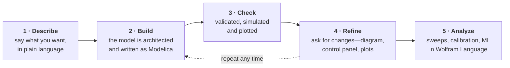

# Wolfram System Modeler Skills

**Teach your AI coding assistant to build, simulate and debug
[Wolfram System Modeler](https://www.wolfram.com/system-modeler/) models.**

[**Download a free 30-day System Modeler trial →**](https://www.wolfram.com/system-modeler/trial/)

A bundle of skills that let an AI coding assistant—[**Claude Code**](https://claude.com/claude-code),
[**OpenAI Codex**](https://openai.com/codex/) or any LLM agent with
command-line access—work with
[Wolfram System Modeler](https://www.wolfram.com/system-modeler/) (and
[Modelica](https://www.wolfram.com/system-modeler/resources/what-is-modelica/)).
A *skill* is simply a folder of instructions and tools that the assistant reads
and runs on your behalf.

The skills **create, validate, simulate, diagnose, plot, animate and document** models,
and **post-process** results with Wolfram Language. They also look up answers
from the Modelica and System Modeler documentation.

Compiling and simulating run on System Modeler's kernel—but the models the
skills write are standard Modelica `.mo` files you can open in any Modelica tool.

> [!TIP]
> **New to Modelica?** It's the open modeling language that System Modeler is built
> on—the textual form behind the drag-and-drop diagrams, stored in `.mo` files.
> These skills read and write that text, so your assistant can build and check
> models as code. See [What Is Modelica?](https://www.wolfram.com/system-modeler/resources/what-is-modelica/)
> for a short introduction.

## What's inside

| Capability | What the assistant does |
|---|---|
| **Architect** | Decide component decomposition, connectors and structure before writing equations |
| **Create** | Write a Modelica model from a plain-language description |
| **Validate & simulate** | Check that a model compiles, then run it |
| **Diagnose** | Explain why a model is slow or failing |
| **Plot** | Plot simulation results and store those plots back inside the model |
| **Search the docs** | Answer from the Modelica Language Specification and the System Modeler documentation, with cited sources (works offline) |
| **Annotate** | Turn a text-only model into a proper schematic |
| **Add control panels** | Add interactive sliders, checkboxes and menus for tuning parameters in the Explore view of Simulation Center (System Modeler's simulation GUI) |
| **Post-process** | Run parameter sweeps, calibration and ML on simulation results in Wolfram Language |

## How it works

Describe what you want, get a checked model back, then refine and analyze—all
in plain language. The modeling, compiling and simulating run for you.

## Get started in three steps

### 1. Get the folder

Clone this repository or download it as a ZIP (*Code → Download ZIP* on GitHub)
and uncompress it. Keep it as one folder; don't move the pieces apart. To update
later, `git pull` (or redownload).

### 2. Start your AI assistant in it

Point your assistant at the **uncompressed folder** so it can read the files
and run commands. In a terminal, open the folder and start the assistant there
(run `claude` for Claude Code, `codex` for Codex); in a desktop app such as the
Claude Desktop app, choose this folder as the session's project folder.

### 3. Ask it to read `InstallationGuide.md`

> "Read `InstallationGuide.md` in this folder and install these skills for me."

The assistant sets the skills up for your environment (for Claude Code it runs
the bundled installer) and checks the **requirements**—Python 3; for the
simulation features, **Wolfram System Modeler**
([free 30-day trial](https://www.wolfram.com/system-modeler/trial/)) plus a
C++ compiler; and for post-processing, **Wolfram Language** connected to the
assistant via the
[Wolfram Local MCP](https://www.wolfram.com/artificial-intelligence/mcp/local/).
It will flag anything missing; just follow its prompts.

That's it—now try it out. Ask for something real, for example:

> "Create a hydraulic circuit with a pump and a double-acting cylinder, then
> validate it to check that it compiles."

> "What's new in Wolfram System Modeler 15?"

The assistant will use the relevant skills to build, check and explain—citing
its sources where it looked things up.

> [!NOTE]
> Setting up in Claude Code, Codex or another agent, or curious about exactly
> what each skill needs? It's all in [`InstallationGuide.md`](InstallationGuide.md)—a
> guide your AI assistant reads to do the setup, not a manual you work through.

## License

This product incorporates portions of the Modelica® Language Specification.

This project is licensed under the [MIT License](LICENSE), **except** for the
documentation bundled with `search-modelica-docs`:

- **Modelica Language Specification** excerpts (`docsearch/data/spec.json`)—licensed
  by the Modelica Association under
  [CC BY-SA 4.0](https://creativecommons.org/licenses/by-sa/4.0/) and
  distributed here under the same license
- **Modelica Standard Library** reference (`docsearch/data/msl.json`)—©
  Modelica Association and contributors, under the
  [BSD 3-Clause License](https://github.com/modelica/ModelicaStandardLibrary/blob/master/LICENSE)
- **Wolfram System Modeler documentation** excerpts (`docsearch/data/docs.json`)—©
  Wolfram Research, Inc., Wolfram's own product documentation, distributed here
  by Wolfram; see
  [reference.wolfram.com/system-modeler](https://reference.wolfram.com/system-modeler/)
  for the original

See [`search-modelica-docs/ATTRIBUTION.md`](search-modelica-docs/ATTRIBUTION.md) for
full attribution, license texts and the ShareAlike obligation.

---

Enjoy using the skills! 🛠️

